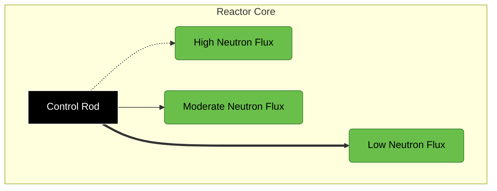

### Control of Nuclear Reactors

The operation of a nuclear reactor is fundamentally dependent on the way in which neutrons interact with atomic nuclei. **Controlling a nuclear reactor involves manipulating the effective multiplication factor (keff), also known as reactivity**, to ensure a stable and safe chain reaction.(The control of nuclear reactors centers around manipulating the effective multiplication factor (keff), also known as reactivity, to maintain a stable and safe chain reaction.) There are four primary methods for achieving this:

- **Control Rods:** Widely used in thermal reactors, control rods are composed of materials with high neutron absorption cross-sections, such as **boron, cadmium, hafnium, or rare earth oxides like samarium, europium, and gadolinium**. These rods can be inserted or withdrawn from the reactor core to regulate the neutron population and, consequently, the fission rate. Silver and indium are sometimes used as alloys with cadmium in control rods. **The depth of insertion directly affects the reactivity**. Deeper insertion increases neutron absorption, decreasing reactivity and slowing down the chain reaction. Conversely, withdrawing control rods reduces absorption, increasing reactivity and accelerating the reaction.
    
- **Moderator:** The moderator is responsible for slowing down fast neutrons produced in fission to thermal energies, where they are more likely to cause further fission. **Altering the amount or density of the moderator can affect the rate of neutron thermalization and thus impact reactivity**.
    
- **Reflector:** A reflector surrounding the reactor core helps **minimize neutron leakage by scattering neutrons back into the core**. Modifications to the reflector configuration can impact the number of neutrons retained within the core, influencing the overall reactivity.
    
- **Fuel:** The fuel's composition and enrichment level directly impact the reactor's reactivity. **Adjusting the fuel load or enrichment can impact the rate of fission and neutron production**, thereby controlling the chain reaction.
    
A comprehensive control system typically employs a combination of these methods. Reactors often utilize **four types of control rods** to achieve the desired range, accuracy, and safety:

- **Shim rods:** These rods provide **coarse control** of the reactor's power level. They are larger than regulating rods and are moved slowly to adjust the reactor's power output to the approximate desired level.
    
- **Regulating rods:** Designed for **fine control**, regulating rods make small adjustments to maintain the reactor's power output at a constant level. They are capable of rapid movement to counteract any fluctuations affecting the reactor.
    
- **Safety rods:** Safety rods are designed for **rapid shutdown**, also referred to as a "SCRAM," in emergencies. Their reactivity equivalent is significantly greater than the maximum excess reactivity built into the reactor, ensuring a swift reduction in the chain reaction. **Backup safety devices may include boron-steel shot that can be introduced into the reactor or solutions of boric acid that can be injected into the core if safety rods fail**.
    
- **Backup device:** As an extra safety measure, most reactors are equipped with a backup safety device. These are used in extreme events like earthquakes and act as a failsafe mechanism to prevent uncontrolled chain reactions.
    
In addition to control rods, other factors influencing reactor control include:

- **Fission Product Poisoning:** Fission products, the byproducts of nuclear fission, absorb neutrons to varying degrees. The buildup of these fission products acts as a long-term reactivity effect, as they reduce the number of neutrons available for sustaining the chain reaction.
    
- **Heat Generation and Removal:** Heat generated within the reactor core, primarily from the kinetic energy of fission fragments, must be effectively managed and removed to maintain safe operating temperatures. The rate of heat removal impacts the core temperature, influencing various reactor parameters and reactivity.
    
The purpose of a nuclear reactor dictates the specific design and control mechanisms employed. Some common purposes include research and teaching, isotope and plutonium production, electricity generation, aircraft and ship propulsion, and breeding of fissile materials.
#### Control Rod & Control Material in Nuclear Reactor

**Control rods are essential components in nuclear reactors, serving to regulate the rate of nuclear fission and control the reactor's power output.** They achieve this by absorbing neutrons, effectively reducing the number of neutrons available to sustain the chain reaction.

**The effectiveness of a control rod is determined by the neutron absorption cross-section of the material it is composed of.** Materials with high neutron absorption cross-sections, known as **control materials**, are specifically chosen for this purpose.

**Control Materials:**

- **Boron:** Boron has a high neutron absorption cross-section, particularly for thermal neutrons. It is commonly used in the form of **boron steel** or **boron carbide (B4C)** for control rods. Boron can also be used as a burnable poison, which gradually depletes over the reactor's operational life, compensating for fuel depletion.
    
- **Cadmium:** Cadmium is another excellent neutron absorber, especially for thermal neutrons. **Cadmium rods or strips** are frequently used in reactor control systems.
    
- **Hafnium:** Hafnium exhibits a strong affinity for absorbing neutrons, making it suitable for control rod applications. It also possesses desirable mechanical properties and corrosion resistance, making it well-suited for use in harsh reactor environments.
    
- **Rare Earth Oxides:** Certain rare earth elements, including **samarium, europium, and gadolinium**, form oxides with high neutron absorption cross-sections. These oxides are employed as control materials, either in solid form or as additives to other materials.
    
- **Silver and Indium:** These elements are sometimes used as alloying components with cadmium to enhance the mechanical strength and neutron absorption properties of control rods.
    
**Types of Control Rods:**

Nuclear reactors typically utilize four primary types of control rods to achieve the desired range, accuracy, and safety in reactivity control:

- **Shim Rods:** These large rods provide coarse control, adjusting the reactor's overall power level. They are moved slowly to achieve the desired power output.
    
- **Regulating Rods:** Smaller in size than shim rods, regulating rods are designed for fine control, maintaining a constant power output and counteracting minor fluctuations. They are capable of rapid movement to adjust reactivity quickly.
    
- **Safety Rods:** These rods are designed for rapid shutdown ("SCRAM") in emergencies. Their high reactivity worth allows for a swift reduction in the chain reaction to prevent uncontrolled power excursions.
    
- **Backup Devices:** As a failsafe mechanism, reactors employ backup safety devices, such as boron-steel shot or solutions of boric acid, that can be introduced to prevent uncontrolled chain reactions in extreme situations.
    

In addition to control rods, the control of nuclear reactors involves other factors, such as:

- **Fission Product Poisoning:** The accumulation of fission products, which absorb neutrons, gradually reduces reactivity over time. This long-term effect must be considered and compensated for during reactor operation.
    
- **Heat Generation and Removal:** The rate of heat generation within the reactor core, primarily from fission, must be carefully managed. Effective heat removal ensures that the reactor operates within safe temperature limits, preventing damage and ensuring stability.
    
The combination of control rods, material selection, and operational strategies ensure the safe and efficient operation of nuclear reactors. The specific design and control mechanisms are tailored to the reactor's purpose, whether it be research, power generation, or other applications.

===> **What are the functions of control rods in a reactor system??**

**Control rods play a critical role in regulating the operation of nuclear reactors**. Their primary function is to **absorb neutrons**, thereby controlling the rate of nuclear fission and the reactor's power output. This is achieved by carefully selecting materials with high neutron absorption cross-sections, known as **control materials**. Examples include:

- Boron (commonly in the form of boron steel or boron carbide)
- Cadmium
- Hafnium
- Rare earth oxides, such as samarium, europium, and gadolinium

**Reactors typically employ four main types of control rods**, each designed for a specific function:

1. **Shim Rods:** These rods are responsible for the **coarse control** of the reactor's power level. They are larger in dimension compared to regulating rods and need to be moved slowly. Their primary purpose is to bring the reactor's power output to the approximate desired level.
    
2. **Regulating Rods:** Regulating rods are used for **fine control** of the reactor's power, making precise adjustments to maintain a constant power level and counteract any fluctuations that may occur. They have a smaller reactivity equivalent but are capable of moving rapidly.
    
3. **Safety Rods:** Safety rods are crucial for **rapidly shutting down the reactor**, a process referred to as "SCRAM," in the event of an emergency. They are designed to move very quickly and possess a reactivity equivalent that exceeds the maximum excess reactivity of the reactor. This ensures a prompt and effective reduction in the chain reaction, preventing potentially dangerous power excursions.
    
4. **Backup Devices:** Most reactors incorporate backup safety devices, such as **boron-steel shot** or **boric acid solutions**, as a failsafe measure in extreme emergencies like earthquakes. These devices provide an additional layer of protection to ensure the reactor can be shut down and controlled even if primary control mechanisms fail.
    
**The functions of control rods extend beyond simply starting and stopping a reactor**:

- **Compensate for Fuel Depletion:** As the nuclear fuel in a reactor is consumed, its reactivity decreases. Control rods can be gradually withdrawn to counteract this effect and maintain the desired power output over the reactor's operational life.
    
- **Control Power Distribution:** By strategically positioning and manipulating control rods within the core, operators can influence the spatial distribution of power generation. This helps optimize fuel utilization and prevent localized power peaks that could damage fuel elements.
    
- **Experimentation and Isotope Production:** In research reactors, control rods can be used to create specific neutron flux conditions needed for various experiments or to control the production of radioactive isotopes.
    

**In addition to the functions of control rods, maintaining a safe and stable reactor system relies on a comprehensive understanding of:**

- **Fission Product Poisoning:** Fission products, which are byproducts of nuclear fission, can act as neutron absorbers, gradually reducing reactivity over time. This effect necessitates adjustments to control rod positions or fuel management strategies to maintain the desired operational parameters.
    
- **Heat Generation and Removal:** The heat generated during fission must be efficiently removed to prevent overheating and damage to reactor components. Controlling the rate of heat removal is essential for maintaining stable operating temperatures.
    
**The effective and safe operation of a nuclear reactor depends on a complex interplay of factors, with control rods serving as a fundamental tool for regulating the chain reaction and ensuring the system remains within safe operational limits.**
#### **Essential Properties of Control Materials**

Control materials are substances used in nuclear reactors to absorb neutrons and regulate the chain reaction. They are crucial for ensuring safe and efficient reactor operation. Here are the key properties that make a material suitable for use as a control material in a nuclear reactor:

- **High Neutron Absorption Cross-Section:** This is the most important property of a control material. A high neutron absorption cross-section, particularly for thermal neutrons, enables the material to effectively capture neutrons and reduce the rate of fission. The higher the cross-section, the more effective the material is at controlling the chain reaction.
    
- **Good Mechanical Properties:** Control rods, often composed of control materials, need to be inserted and withdrawn from the reactor core. This requires materials with good mechanical strength and dimensional stability to withstand the harsh conditions within the reactor environment.
    
- **Resistance to Corrosion and Radiation Damage:** The reactor core is a highly corrosive and radioactive environment. Control materials must be able to withstand these conditions without degrading or losing their neutron absorption capabilities over time.
    
- **Compatibility with Reactor Coolant:** The control material should not react with or adversely affect the coolant used in the reactor. This ensures the integrity of the control rods and the efficiency of the cooling system.
    
- **Availability and Cost-Effectiveness:** The ideal control material should be readily available and economically viable to manufacture and process for use in reactor systems.
    
**Examples of control materials and their properties:**

- **Boron:** Boron has a very high neutron absorption cross-section, making it a highly effective control material. It is commonly used in the form of boron steel, boron carbide, or as a burnable poison.
    
- **Cadmium:** Cadmium is another excellent neutron absorber, particularly for thermal neutrons, and is often used in the form of rods or strips in control mechanisms.
    
- **Hafnium:** Hafnium exhibits a strong neutron absorption capacity and possesses excellent mechanical strength and corrosion resistance. These properties make it well-suited for demanding reactor environments.
    
- **Rare Earth Oxides (Samarium, Europium, Gadolinium):** Certain rare earth elements form oxides with high neutron absorption cross-sections. These oxides can be used in solid form or as additives to other materials to enhance their neutron-absorbing properties.
    
- **Silver and Indium:** These elements are sometimes alloyed with cadmium to improve the mechanical strength and neutron absorption capabilities of control rods.
    
The selection of specific control materials for a reactor depends on various factors, including the reactor type, its operating conditions, and the desired control characteristics. Understanding the essential properties of control materials is paramount for designing, operating, and ensuring the safety of nuclear reactor systems.
#### Purpose for nuclear reactor designed

Nuclear reactors are designed for a variety of purposes, reflecting their versatility in harnessing nuclear energy. Here are some typical applications:

- **Research and Teaching:** Research reactors provide a controlled environment for scientific investigations and educational purposes. These reactors often operate at lower power levels and offer access to high neutron fluxes for experiments in fields like materials science, physics, and medicine. They can be used to study radiation effects on materials, produce radioisotopes for medical and industrial applications, and conduct fundamental research in nuclear physics.
    
- **Isotope and Plutonium Production:** Reactors can be specifically designed to produce radioactive isotopes used in medical diagnostics and treatments, industrial applications, and research. Additionally, reactors can be used to produce plutonium-239, a fissile material that can be used as fuel in other reactors or in nuclear weapons. This process involves bombarding uranium-238 with neutrons, leading to the formation of plutonium-239 through a series of nuclear reactions.
    
- **Generation of Electric Power:** Power reactors are the workhorses of the nuclear industry, generating electricity for homes and businesses worldwide. These reactors produce heat through nuclear fission, which is then used to create steam that drives turbines connected to generators. Power reactors come in various designs, including pressurized water reactors (PWRs), boiling water reactors (BWRs), and gas-cooled reactors.
    
- **Aircraft and Ship Propulsion:** Nuclear reactors have been used to power submarines and aircraft carriers, providing a long-range and reliable source of propulsion. The compact nature of nuclear reactors makes them well-suited for these applications where space and weight are significant considerations.
    
- **Breeding of Fissile Materials:** Breeder reactors are designed to produce more fissile material than they consume. This is achieved by converting fertile materials like uranium-238 or thorium-232 into fissile materials like plutonium-239 or uranium-233. Breeder reactors offer the potential to extend the lifespan of nuclear fuel resources significantly. The conversion factor, a measure of a reactor's breeding capability, depends on factors like neutron capture rates and fuel composition.
#### Reactor operation

**Reactor Operation** encompasses all the processes and procedures involved in safely and efficiently harnessing nuclear energy within a reactor system. This multifaceted endeavor involves:

- **Startup:** Initiating a controlled chain reaction by gradually withdrawing control rods and increasing the reactor's power level.
    
- **Power Level Control:** Maintaining a desired power output through careful adjustments of control rods to balance neutron production and neutron loss, ensuring a stable chain reaction with keff = 1.
    
- **Monitoring and Instrumentation:** Continuous surveillance of critical parameters such as neutron flux, temperature, pressure, and coolant flow, using a suite of sensors and instruments to detect any deviations from normal operating conditions.
    
- **Reactivity Management:** Accounting for and compensating for changes in reactivity due to factors like:
    
    - Fuel burnup: Depletion of fissile isotopes like U-235 and Pu-239.
    - Fission product poisoning: Accumulation of neutron-absorbing fission products.
    - Temperature effects: Changes in reactor parameters influencing neutron absorption and leakage.
- **Fuel Management:** Optimizing fuel utilization, involving strategies like:
    
    - Fuel shuffling: Rearranging fuel elements within the core to achieve a more even power distribution.
    - Refueling: Replacing spent fuel with fresh fuel to maintain the reactor's operational lifespan.
- **Heat Removal:** Efficiently extracting heat generated in the core through a suitable coolant system, ensuring that fuel elements and other reactor components remain within safe temperature limits. Heat sources include the kinetic energy of fission fragments, slowing down of neutrons and beta particles, and absorption of gamma radiation. Approximately 90% of the heat is released within the reactor core, with the remaining 10% originating from gamma radiation.
    
- **Safety Systems:** Implementing multiple layers of safety features to prevent and mitigate potential accidents, including:
    
    - Safety rods for rapid shutdown (SCRAM).
    - Backup safety devices.
    - Containment structures to prevent the release of radioactive materials.
- **Shutdown:** Safely reducing the reactor's power level and eventually halting the chain reaction by inserting control rods into the core. Special considerations apply to post-shutdown reactivity changes, such as xenon buildup, requiring sufficient excess reactivity to restart the reactor.
    
- **Waste Management:** Handling and disposing of radioactive waste generated during reactor operation in accordance with safety regulations and environmental protection protocols.
    
**Understanding the principles of nuclear chain reactions** and the factors influencing reactor behavior is fundamental to safe and effective operation.

**Historical events, such as the Chernobyl and Fukushima accidents**, serve as stark reminders of the potential consequences of operational failures, highlighting the paramount importance of rigorous safety protocols and robust control systems.

**Reactor operation is a complex and demanding field requiring skilled personnel with expertise in various disciplines, including nuclear physics, engineering, chemistry, and materials science.** A comprehensive understanding of reactor physics, coupled with meticulous adherence to safety guidelines and best practices, is crucial for the responsible and sustainable utilization of nuclear energy.
### Specification of Reactor Control Systems

A nuclear reactor control system must meet three main requirements:

1. **Range:** The control system must be able to adjust the total amount of reactivity in the reactor over a wide enough range for both operation and safety. For example, the system needs to have enough reactivity to start up the reactor, bring it to its desired power level, and compensate for changes in reactivity due to fuel burnup and fission product poisoning. It also needs to be able to shut down the reactor quickly in an emergency.
2. **Accuracy:** The control system must be able to control the reactor's power level accurately and responsively, closely following the operator's commands or the control system's formula. This is important for ensuring the safe and efficient operation of the reactor.
3. **Efficiency:** The control system must be efficient in terms of neutron economy, power economy, and economy of operation. This means that it should minimize neutron losses, use power efficiently, and be easy to operate.

#### Methods for Controlling Reactivity

There are four general methods for varying a reactor's effective multiplication factor (keff) or reactivity, which involve adding or removing:

1. Fuel
2. Moderator
3. Reflector
4. Neutron Absorber

Each of these methods, or a combination of them, can be used to control a nuclear reactor. For example, **control rods** made of materials with high neutron absorption cross-sections (like boron, cadmium, or hafnium) are commonly used to control thermal reactors.
### Types of Control Rods and Their Functions

To achieve the desired range, accuracy, and safety, most reactors use four types of control rods:

1. **Shim Rods:** These rods, which are larger than regulating rods, provide coarse control for adjusting the reactor's power level. Shim rods should be moved slowly because they have a significant effect on reactivity. They are used to bring the reactor to approximately the desired power level.
2. **Regulating Rods:** These rods provide fine control of the reactor's power. Regulating rods are used to adjust the reactor to the exact operating level and keep the power constant during operation. They have a small reactivity equivalent, but they can move quickly to counteract changes affecting the reactor.
3. **Safety Rods:** These rods are designed to shut down the reactor quickly in an emergency ("SCRAM"). They can move very rapidly and have a reactivity equivalent greater than the maximum excess reactivity of the reactor.
4. **Backup Safety Device:** In addition to control rods, most reactors have a backup safety device for extreme emergencies like earthquakes. This device might involve boron-steel shot or a boric acid solution that can be rapidly introduced into the reactor to absorb neutrons and shut down the chain reaction.
### Other Considerations for Reactor Control

- **Fission Product Poisoning:** The buildup of fission products in the reactor core, which absorb neutrons and reduce reactivity, must also be considered in the design and operation of the control system.
- **Energy Removal:** The control system must be designed to work in conjunction with the reactor's cooling system to ensure that the reactor can be safely operated at its desired power level. The spatial distribution of the heat source within the reactor is not uniform and is determined by the neutron and gamma ray fluxes. The majority of the heat is generated from the kinetic energy of fission fragments within the fuel elements.
- **Choice of Control Materials:** The choice of materials for control rods depends on the type of reactor, its operating conditions, and the desired control characteristics. Factors to consider include neutron absorption cross-sections, mechanical properties, resistance to corrosion and radiation damage, and compatibility with the reactor coolant.

The information provided in these sources primarily focuses on the operation and control of thermal reactors, where most fissions are induced by thermal neutrons. Fast reactors, which operate with fast neutrons, may have different control requirements and mechanisms. For information on the specifics of fast reactor control, it is recommended to consult specialized sources.
### Burnable Poison

**Burnable Poisons** are materials with a high neutron absorption cross-section that are strategically incorporated into a reactor core to help control reactivity. They are designed to **gradually burn up** (transmute) into materials with relatively low absorption cross-sections as they absorb neutrons. This burn-up process causes the negative reactivity contribution of the burnable poison to decrease over the reactor's operational life, counteracting the effects of fuel burnup and fission product poisoning.

**Key characteristics of burnable poisons include:**

- **High initial neutron absorption cross-section:** This enables them to effectively absorb neutrons and suppress excess reactivity at the beginning of the reactor's fuel cycle.
- **Gradual burn-up:** The poison is gradually consumed by neutron absorption, reducing its negative reactivity contribution and compensating for reactivity loss due to fuel depletion.
- **Conversion to low-absorbing isotopes:** The neutron absorption process transmutes the poison into isotopes with lower absorption cross-sections, minimizing their long-term impact on neutron economy.

**Examples of burnable poisons** include:

- **Boron**: Often used in the form of boric acid dissolved in the reactor coolant, providing a flexible means of controlling reactivity.
- **Gadolinium**: Commonly employed as an additive in fuel pellets, offering a more localized reactivity control within the fuel itself.
- **Samarium**: A fission product with a high absorption cross-section, can be intentionally added to the fuel or utilized for its inherent poisoning effect.
- **Europium**: Similar to samarium, europium can also act as a burnable poison.

**Benefits of using burnable poisons:**

- **Improved fuel utilization:** By compensating for excess reactivity early in the fuel cycle, burnable poisons allow for a higher initial fuel loading, extending the operational life of the fuel.
- **Reduced control rod movement:** The use of burnable poisons minimizes the need for frequent adjustments of control rods, simplifying reactor operation and reducing wear and tear on control rod mechanisms.
- **Flattening of the neutron flux:** Strategically placing burnable poisons within the core can help achieve a more uniform neutron flux distribution, leading to more even power generation and fuel burnup.

**In addition to burnable poisons, reactors utilize various other control mechanisms** including:

- **Control rods**: Rods made of neutron-absorbing materials are used for rapid shutdown, coarse power adjustments, and fine-tuning of the power level.
- **Moderator control**: Changing the amount or configuration of the moderator can influence neutron moderation and reactivity.
- **Reflector control**: Adjusting the position or composition of the reflector can affect neutron leakage and reactivity.
- **Fuel management**: Strategies for refueling and fuel shuffling play a vital role in controlling reactivity over the reactor's operational lifespan.

**The selection of appropriate control mechanisms and strategies depends on the reactor type, operating conditions, and design objectives.**

The sources provided do not specifically mention the term "burnable poison," however, the information presented in the context of reactor control systems and reactivity management aligns with the concept of burnable poisons.
### Fission Product Poisoning

**Fission Product Poisoning** occurs when the **fission products** generated during nuclear fission **accumulate in the reactor core and absorb neutrons**, thereby **reducing the reactor's reactivity**. This phenomenon is a crucial consideration in reactor control and operation.

- **Fission Products as Neutron Poisons:** All fission products act as reactor poisons to some extent as they absorb neutrons. Some fission products have particularly high neutron absorption cross-sections, making them more significant poisons. The buildup of these poisons over time can impact reactor performance and require compensation through control mechanisms.
    
- **Impact on Reactivity:** The accumulation of fission products leads to a decrease in the effective multiplication factor (keff), which measures the reactor's ability to sustain a chain reaction. This decrease in reactivity must be accounted for in the design and operation of the reactor control system.
    
- **Reprocessing to Address Poisoning:** One way to mitigate fission product poisoning is through fuel reprocessing. This involves removing spent fuel from the reactor and chemically separating the valuable fissile and fertile materials (like uranium and plutonium) from the fission products. The recovered fissile material can then be reused in new fuel elements.
    
- **Cooling Period and Radioactive Decay:** After being discharged from the reactor, spent fuel is typically stored in cooling pools to allow for the decay of short-lived radioactive isotopes. This cooling period helps reduce the overall radioactivity of the fuel and facilitates safer handling during reprocessing. The cooling time also allows for the decay of certain heavy isotopes that cannot be easily separated from the final products, making their radioactivity less of a concern.
    
- **Specific Examples:** While the sources don't explicitly detail specific fission products responsible for poisoning, **xenon-135 (Xe-135)** and **samarium-149 (Sm-149)** are well-known examples of fission products with significant poisoning effects.
    
**Key Considerations for Fission Product Poisoning:**

- **Reactor Type:** The type of reactor and its operating conditions influence the rate and extent of fission product buildup.
- **Fuel Burnup:** As fuel is consumed, the concentration of fission products increases, leading to greater poisoning effects.
- **Control Strategies:** Reactor control systems must incorporate strategies to compensate for fission product poisoning, including the use of burnable poisons, control rod adjustments, and fuel management techniques.

**Fission product poisoning is a fundamental aspect of reactor physics and plays a critical role in the safe and efficient operation of nuclear reactors.**
### Reactor Kinematics

**Reactor kinetics** is the study of how the **neutron population** and **power output of a reactor change over time.** This field is crucial for understanding **reactor control**, **safety**, and **operational transients.**

**Key Concepts in Reactor Kinetics:**

- **Neutron Lifetime:** The average time a neutron exists from its birth in fission to its absorption or leakage from the reactor. Neutron lifetime significantly influences the reactor's time response to changes in reactivity.
- **Reactivity:** A measure of the deviation of a reactor from criticality (keff = 1). It quantifies the balance between neutron production and loss. Positive reactivity leads to an increasing neutron population, while negative reactivity results in a decreasing population.
- **Reactor Period:** The time it takes for the neutron population (and thus the reactor power) to change by a factor of _e_ (approximately 2.718). The reactor period is a key indicator of the rate at which the reactor is changing its power level.
- **Delayed Neutrons:** A small fraction of neutrons released in fission are emitted with a delay, ranging from fractions of a second to minutes. These delayed neutrons have a profound impact on reactor controllability, making reactors much safer to operate.
- **Prompt Neutrons:** Neutrons released immediately from fission. While the majority of neutrons are prompt, the delayed neutrons are crucial for controlling the chain reaction.

**Factors Affecting Reactor Kinetics:**

- **Changes in Reactivity:** Alterations in reactivity can arise from various sources, including control rod movement, temperature changes, fission product poisoning, and fuel burnup.
- **Feedback Mechanisms:** Reactors exhibit feedback mechanisms where changes in parameters like temperature or void formation can influence reactivity, leading to either positive or negative feedback loops.
- **External Inputs:** External factors like changes in coolant flow, control rod position, or neutron source strength can impact reactor kinetics.

**Applications of Reactor Kinetics:**

- **Reactor Control:** Understanding reactor kinetics is essential for designing and operating control systems to maintain a stable and desired power level.
- **Safety Analysis:** Kinetics calculations are crucial for assessing reactor safety, predicting responses to potential accidents, and designing safety systems.
- **Operational Transients:** Analyzing reactor kinetics helps operators understand and manage transient events, such as power changes, startup, and shutdown.

**Mathematical Models:**

Reactor kinetics is typically described using **mathematical models**, such as the **point kinetics equations**. These equations consider the reactor as a single point in space and track the changes in neutron population over time. More complex models can account for spatial variations in neutron flux and other parameters.

**Relationship to Control Systems:**

Reactor kinetics is closely tied to the **reactor control systems** discussed previously. Control systems rely on kinetics principles to manipulate reactivity and achieve the desired reactor behavior, whether it's maintaining a steady power output or safely shutting down the reactor.

The information from the provided sources focuses primarily on **steady-state reactor behavior** and **control mechanisms** that influence reactivity. While these concepts lay a foundation for understanding reactor kinetics, they do not delve into the dynamic aspects of how neutron population and power change with time.

**To gain a comprehensive understanding of reactor kinetics, it is recommended to consult dedicated resources on this specific topic within the field of nuclear engineering and reactor physics.**
#### General Features of Reactor Control

**The control of a nuclear reactor involves manipulating its reactivity to achieve and maintain a desired power level and ensure safe operation.** Reactivity is a measure of the deviation from criticality (keff = 1). It represents the balance between neutron production and neutron loss in the reactor.

**General Methods for Varying Reactivity:**

- **Fuel:** Adding or removing fuel directly impacts the number of fissionable nuclei available for neutron-induced fission.
- **Moderator:** The moderator slows down neutrons to thermal energies, making them more likely to induce fission. Changing the amount or configuration of the moderator can influence neutron moderation and reactivity.
- **Reflector:** The reflector surrounds the core and helps to reduce neutron leakage. Adjusting the reflector can affect neutron loss and thus reactivity.
- **Neutron Absorber:** Introducing neutron-absorbing materials (poisons) into the core reduces the number of neutrons available for fission.

**Control Rods and Their Functions:**

**Control rods** are a primary means of reactivity control in many thermal reactors. They contain materials with a high neutron absorption cross-section, such as:

- Boron
- Cadmium
- Hafnium
- Rare-earth oxides (samarium, europium, and gadolinium)

**Types of Control Rods:**

- **Shim Rods:** Used for coarse control to bring the reactor power level approximately to the desired level. They have larger dimensions than regulating rods and are moved slowly.
- **Regulating Rods:** Used for fine control to achieve the precise operating level and maintain a constant power output. They have a smaller reactivity equivalent compared to shim rods but can move rapidly to counteract changes affecting the reactor.
- **Safety Rods:** Designed for rapid shutdown ("SCRAM") in emergencies. They have a high reactivity equivalent, exceeding the maximum excess reactivity built into the reactor, and are capable of very rapid movement.

**Backup Safety Devices:**

In addition to control rods, most reactors have a backup safety device for extreme emergencies (e.g., earthquakes). These devices can include:

- Boron-steel shot that can be introduced into voids in the reactor
- Solutions of boric acid that can be injected into the core

**Fission Product Poisoning:**

Fission product poisoning is a significant factor in reactor control. As fission products accumulate in the core, they absorb neutrons and reduce reactivity. Strategies to manage fission product poisoning include:

- **Fuel Reprocessing:** Removing spent fuel and separating fissile material from fission products.
- **Cooling Period:** Allowing spent fuel to decay, reducing radioactivity and the concentration of certain fission products.

**Specification of a Control System:**

A complete control system is specified based on these main requirements:

- **Range:** The total amount of reactivity the system can control.
- **Accuracy:** The closeness with which the reactor's behavior matches the operator's commands or the control system's formula.
- **Efficiency:** A combined measure of neutron economy, power economy, and operational economy.

**The design and implementation of reactor control systems require a deep understanding of reactor physics, kinetics, and engineering principles.** The selection of appropriate control mechanisms and strategies depends on the specific reactor type, operational objectives, and safety considerations.

#### Effects of Temperature on Reactivity

The **temperature of a nuclear reactor significantly influences its reactivity**. Reactivity, a measure of a reactor's deviation from criticality (keff = 1), is affected by temperature changes due to alterations in nuclear cross-sections, material densities, and the reactor's physical dimensions. The **temperature coefficient of reactivity (dp/dT)** quantifies the change in reactivity per degree of temperature change.

**Nuclear Temperature Coefficient:**

- The **nuclear temperature coefficient** accounts for changes in reactivity due to temperature-dependent variations in **nuclear cross-sections**. As the reactor temperature rises, the average thermal energy of neutrons increases. Since absorption cross-sections are energy-dependent, they change with temperature, impacting neutron absorption rates and overall reactivity.
    
- For a **homogeneous reactor**, assuming the thermal cross-sections follow the 1/v law, the thermal utilization factor (f) is independent of temperature. However, for a **heterogeneous reactor**, the thermal disadvantage factor decreases with increasing temperature because the reduced uranium absorption cross-section allows a more even neutron flux distribution across the lattice cells. This results in an **increased thermal utilization factor (f)**.
    
- The **resonance escape probability (p)** generally **decreases with increasing temperature** because of the broadening of resonance absorption lines of U-235 at higher neutron energies.
    

**Density Temperature Coefficient:**

- The **density temperature coefficient** considers reactivity changes resulting from temperature-induced variations in **material densities**. As the temperature increases, reactor materials expand, leading to a decrease in their densities. These density changes alter macroscopic cross-sections and mean free paths, which depend on the number of nuclei per unit volume (N0).
    
- The **neutron age (τ)** and the **thermal diffusion length (L)** are both inversely proportional to the square of the density. Therefore, a rise in temperature, causing a decrease in density, **increases both the neutron age and the thermal diffusion length**, leading to increased neutron leakage.
    

**Volume Temperature Coefficient:**

- The **volume temperature coefficient** reflects reactivity changes due to **thermal expansion of the reactor core**. As the reactor's size increases with temperature, its buckling (B2), a measure of neutron leakage, decreases.

**Overall Temperature Coefficient:**

The **total temperature coefficient of reactivity** is the sum of the nuclear, density, and volume temperature coefficients. Typically, the **nuclear and density temperature coefficients are negative**, meaning reactivity decreases with increasing temperature. The **volume temperature coefficient is positive** but usually much smaller than the other two. Therefore, for most reactors, the **overall temperature coefficient is negative**, contributing to reactor stability.

**Significance of a Negative Temperature Coefficient:**

A negative temperature coefficient is highly desirable for reactor safety as it provides a **self-regulating mechanism**. When the temperature rises, the negative coefficient reduces reactivity, decreasing the fission rate and subsequently lowering the heat generated. This counteracts the initial temperature rise and helps stabilize the reactor. Conversely, a positive temperature coefficient would lead to an unstable situation, potentially causing a runaway chain reaction.

**Typical Temperature Coefficients:**

The magnitude of the temperature coefficient varies depending on the reactor type, materials, and operating conditions. **Water-moderated reactors generally exhibit larger negative temperature coefficients than graphite-moderated reactors**, providing greater inherent stability.

**Note:** The provided sources primarily focus on steady-state reactor behavior and control mechanisms. While they touch upon the concept of the temperature coefficient, they do not provide in-depth discussions of the underlying physics or quantitative examples. To explore these aspects in detail, consulting dedicated resources on reactor kinetics and temperature effects is recommended.

===> **Graphically show the control rod 'shadowing'**

---

---
