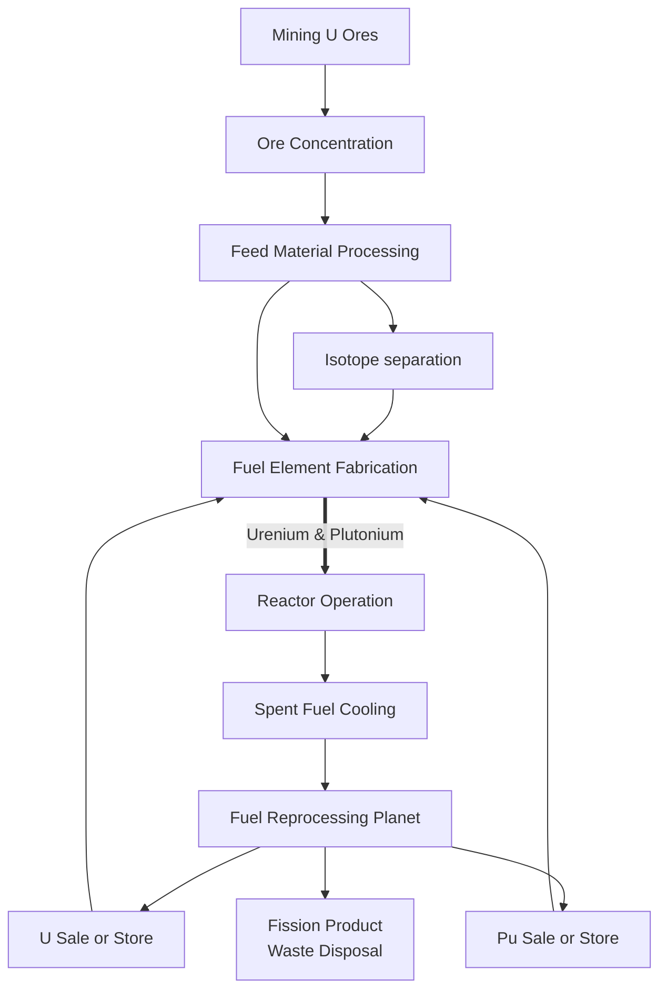
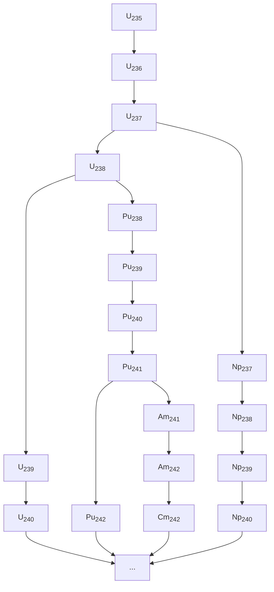

### Nuclear Chain Reaction
A nuclear chain reaction is a self-sustaining process that starts with nuclear fission reactions initiated by neutrons. These reactions destroy fissionable nuclei, release nuclear energy, and produce new neutrons that continue the chain reaction. Uranium-235 (U-235), Uranium-233 (U-233), and Plutonium-239 (Pu-239) are fissionable materials commonly used in nuclear chain reactions. The **most common nuclear chain reaction process uses U-235**. Here's how it works:

1. **Neutron Absorption:** A neutron strikes a U-235 nucleus, causing it to become unstable.
2. **Nuclear Fission:** The unstable U-235 nucleus splits into two smaller nuclei (typically barium-139 (Ba-139) and krypton-94 (Kr-94)), releasing a significant amount of energy.
3. **Neutron Release:** The fission process also releases additional neutrons (typically three).
4. **Chain Propagation:** The released neutrons can then strike other U-235 nuclei, causing further fission reactions and continuing the chain.

The reaction can be represented as follows:

$$^{92}U_{235} + ^0n_1 = ^{56}Ba_{139} + ^{36}Kr_{94} + 3^0n_1$$

**Uncontrolled chain reactions** are used in nuclear bombs, like the one dropped on Hiroshima. **Controlled chain reactions** are used in nuclear reactors.

#### Uncontrolled & Controlled nuclear reaction

**Uncontrolled nuclear reactions** are utilized in **nuclear weapons**, such as the atomic bomb detonated in Hiroshima. These reactions release a **massive amount of energy in an extremely short period**, resulting in a powerful explosion.

**Controlled nuclear reactions**, on the other hand, are harnessed within **nuclear reactors** for various purposes, including **research, isotope production, power generation, and propulsion**. The key difference lies in the ability to **regulate the rate of neutron production and absorption**, ensuring a steady and manageable release of energy.

**Control rods**, composed of materials like boron, cadmium, hafnium, or rare earth oxides, are employed to **absorb excess neutrons and prevent a runaway chain reaction**. By adjusting the position of these control rods, the reactor's **effective multiplication factor (reactivity)** can be carefully controlled to maintain a critical state where **neutron production precisely balances neutron loss**.

   This control mechanism allows nuclear reactors to **operate safely and efficiently**, producing a continuous and reliable source of energy without the risk of uncontrolled explosions

### Reactor Fuel
**Reactor fuel** refers to the materials used in nuclear reactors to sustain a controlled nuclear chain reaction. The most common reactor fuel is **uranium**, but other fissionable materials like **plutonium-239** and **uranium-233** can also be used.

**Uranium** occurs naturally as a mixture of isotopes, with **uranium-235 (U-235)** being the only naturally occurring isotope that readily undergoes fission with thermal neutrons. However, natural uranium contains only about **0.7% U-235**, while the rest is mostly **uranium-238 (U-238)**. U-238 is a **fertile material**, meaning it can absorb neutrons and transform into **plutonium-239 (Pu-239)**, which is a fissile isotope.

**Reactor fuel** is typically fabricated into **fuel elements**, such as rods or pellets, for use in a nuclear reactor. These elements are designed to **withstand the harsh conditions inside the reactor core**. **Several factors** can necessitate the replacement of these fuel elements:

- **Accumulation of fission products**: Fission products are reactor poisons because they absorb neutrons, impacting the reactor's reactivity.
- **Depletion of fissile material**: The consumption of U-235 or Pu-239 reduces the fuel's reactivity.
- **Changes in dimensions and shape**: Exposure to intense reactor conditions and the buildup of fission products can alter the fuel element's structure.
- **Accidental circumstances**: Events like cladding rupture or embrittlement can require fuel element replacement.

**Reprocessing of spent fuel** is essential for recovering valuable fissile materials like uranium and plutonium, reducing the need for new uranium mining and minimizing high-level radioactive waste. This process contributes to a more **sustainable reactor fuel cycle**.

The **kinetic energy of fission fragments** is the primary source of heat generation in a reactor system, with a smaller portion coming from slowing down neutrons, beta particles, and gamma radiation absorption. Fission fragments typically stop within the fuel elements, releasing their energy as heat. High-energy beta particles can travel further, potentially reaching the moderator or coolant. Fission neutrons lose most of their energy through collisions with moderator atoms. Overall, approximately **90% of the heat generated** is released within the reactor core.

The remaining 10% of fission energy is released as gamma radiation.

The choice of reactor fuel and its management throughout the fuel cycle is crucial for the **safe, efficient, and sustainable operation of nuclear reactors**.

#### Reactor Fuel Cycle & it's block diagram
The **reactor fuel cycle** encompasses the entire journey of nuclear fuel, from its initial extraction to its final disposal. The cycle involves several stages, including:

- **Mining**: Uranium, the primary fuel for nuclear reactors, is extracted from uranium ores found in various locations globally. The abundance of uranium in the Earth's crust is approximately 1014 tons.
- **Ore Concentration**: After mining, uranium ore typically undergoes concentration processes to increase the proportion of uranium. This involves techniques such as crushing, screening, washing, flotation, and gravity separation. The objective is to obtain a concentrate with a higher uranium content, making subsequent processing steps more efficient.
- **Feed Material Processing**: In this stage, the concentrated uranium ore is converted into a form suitable for fuel fabrication. This usually involves chemical processes to purify the uranium and convert it into uranium oxide (U3O8) or uranium hexafluoride (UF6).
- **Isotope Separation**: Natural uranium contains a mixture of isotopes, primarily U-238 and a small fraction of U-235. Isotope separation is necessary to enrich the uranium in U-235, the fissile isotope, to a level suitable for reactor operation. This process may involve gaseous diffusion, gas centrifuge, or laser isotope separation techniques
- **Fuel Element Fabrication**: Enriched uranium, in the form of uranium oxide or uranium metal, is fabricated into fuel elements. These elements are typically cylindrical rods or pellets designed to withstand the harsh conditions within a reactor core.
- **Reactor Operation**:Fuel elements are loaded into the reactor core, where they undergo sustained nuclear fission. The fission process releases energy in the form of heat, which is used to generate electricity. During reactor operation, U-235 is consumed, and some U-238 is converted into Pu-239, a fissile isotope.
- **Spent Fuel Cooling**: After a certain period in the reactor, the fuel elements are removed and placed in cooling ponds or dry casks to allow for the decay of short-lived fission products. This reduces the radioactivity and heat generated by the spent fuel.
- **Fuel Reprocessing Planet**: Spent fuel is transported to a reprocessing plant, where it undergoes chemical separation to recover valuable materials like uranium and plutonium. These recovered materials can be recycled back into the fuel fabrication process, reducing the need for fresh uranium and minimizing waste.
- **Fission Product Waste Disposal**: The reprocessing of spent fuel leaves behind radioactive waste products, including fission products and other radioactive isotopes. These waste products require safe and long-term storage or disposal to protect the environment and human health.
- **U Sale or Store**: The recovered uranium from reprocessing can either be sold on the market or stored for future use in fuel fabrication. The decision depends on factors like market demand, storage capacity, and the specific requirements of the nuclear industry.
- **Pu Sale or Store**: Similar to uranium, the recovered plutonium can either be sold or stored. Plutonium is a valuable fissile material that can be used in both nuclear weapons and nuclear reactors. Its sale and storage are subject to strict international regulations and safeguards to prevent its misuse.

	The fuel cycle can be visualized as a closed loop, where the recovered materials are recycled back into the fabrication process, minimizing waste and maximizing resource utilization.

Here is a **block diagram representing the reactor fuel cycle**:

The reprocessing of irradiated fuel elements is crucial for several reasons:

- **Recovery of valuable materials**: Reprocessing allows the extraction of fissile materials like uranium-235 and plutonium-239, which can be reused as fuel, reducing the need for new uranium mining.
- **Reduction of waste**: Reprocessing reduces the volume of high-level radioactive waste that requires long-term storage.
- **Sustainable fuel cycle**: Reprocessing contributes to a more sustainable fuel cycle by maximizing resource utilization and minimizing environmental impact.

The necessity for replacing fuel elements in a reactor arises due to various factors:

- **Depletion of fissile species**: The gradual consumption of fissile isotopes like uranium-235 and plutonium-239 during fission reduces the reactivity of the fuel, potentially hindering reactor operation.
- **Dimensional and shape changes**: Continuous exposure to the intense conditions within a reactor, coupled with the accumulation of fission products, can alter the physical dimensions and shape of fuel elements.
- **Accidental circumstances**: Factors like cladding rupture, thermal shock, weld failures, burnout, corrosion, or embrittlement can necessitate the replacement of fuel elements to ensure reactor safety and integrity.

The efficient management of the reactor fuel cycle is vital for the sustainability and safety of nuclear energy.

### Production of Uranium
The production of uranium involves several stages, beginning with the **mining of uranium ores** and culminating in the **refining of uranium into a usable form for nuclear fuel.**

- **Mining U Ores:** Uranium ores are found in various locations globally. The sources describe the existence of approximately 1014 tons of uranium within the Earth's crust to a depth of 12 miles. These ores are classified into three categories based on their uranium concentration:
    - **Low Grade:** 0.01% uranium (found in the USA)
    - **Medium Grade:** 0.1–0.5% uranium (found in Colorado, Arizona, and Utah in the USA, Canada, and Australia)
    - **High Grade:** 2–5% uranium
- **Ore Concentration:** High-grade ores are subjected to standard metallurgical processes to achieve a concentration of 50% $U_{3}O_{8}$. These processes include crushing, screening, washing, flotation, and gravity separation.
- **Purification:** Two main purification processes are used in the USA:
    
    1. **Solvent Extraction of Uranyl Nitrate Process:** This method involves digesting concentrated uranium with nitric acid (HNO3). The resulting solution is then evaporated to obtain uranyl nitrate hexahydrate (UO2(NO3)2 * 6H2O), also known as UNH.
        
    2. **Volatilization of Uranium Hexafluoride Process:** This process, also known as the fluoride volatility process, begins with grinding and sizing U3O8 concentrate. The sized feed is then introduced into a fluidized-bed reactor at 540–650 °C and reduced using hydrogen gas. The resulting UO2 is then reacted with anhydrous hydrogen fluoride (HF) in two successive hydrofluorination fluidized-bed reactors at temperatures of 480–540 °C and 540–650 °C, respectively. This reaction produces uranium tetrafluoride (UF4), also referred to as "green salt":
		UO2 + 4HF → 2H2O + UF4
    
    - **Producing Uranium Hexafluoride:** The UF4 is then treated with fluorine gas (F2) at temperatures between 340–480 °C to form uranium hexafluoride (UF6).     
		UF4 + F2 → UF6
    - **Producing Metallic Uranium:** To obtain metallic uranium, finely powdered UF4 is heated in a steel mold with either calcium (Ca) or magnesium (Mg) of high purity. This reaction results in the formation of metallic uranium and magnesium fluoride (MgF2):     
		$UF_{4} + 2Mg → U + MgF_{2}$

These processes transform uranium from its raw ore form into purified and usable forms, primarily uranium oxide, uranium hexafluoride, and metallic uranium, suitable for fuel element fabrication and subsequent use in nuclear reactors.

##### Sourcs of Uranium
Uranium is a naturally occurring radioactive element found in the Earth's crust. **The abundance of uranium in the Earth's crust to a depth of 12 miles is estimated to be around 1014 tons**.

The sources of uranium can be categorized based on the concentration of uranium present in the ore:

- **Low-Grade Ores:** These ores contain a very low concentration of uranium, typically around **0.01%**. The United States is a significant source of low-grade uranium ores.
- **Medium-Grade Ores:** These ores have a higher uranium concentration, ranging from **0.1% to 0.5%**. Major sources of medium-grade uranium ores include:
    - Colorado, Arizona, and Utah in the USA
    - Canada
    - Australia
- **High-Grade Ores:** These ores are the richest source of uranium, with concentrations ranging from **2% to 5%**. High-grade ores are typically concentrated to **50% U3O8** using standard metallurgical processes, such as:
    - Crushing
    - Screening
    - Washing
    - Flotation
    - Gravity separation

These various sources of uranium provide the raw material for the nuclear fuel cycle, ultimately leading to the production of nuclear fuel for reactors.

#### Obtain metallic uranium from uranium dioxide 
To obtain **metallic uranium (U)** from **uranium dioxide (UO2)**, a chemical reduction process is employed. The most commonly used method involves reacting uranium tetrafluoride (UF4) with a highly reactive metal, such as magnesium (Mg) or calcium (Ca), at elevated temperatures.

The process involves the following steps:

1. **Preparation of Uranium Tetrafluoride (UF4):** UO2 is first converted to UF4, also known as **"green salt."** This is achieved through a two-step process:
    
    - **Reduction:** UO2 is reduced with hydrogen gas (H2) in a fluidized-bed reactor at temperatures between 540°C and 650°C.
    - **Hydrofluorination:** The resulting uranium oxide is then reacted with anhydrous hydrogen fluoride (HF) in two successive fluidized-bed reactors. The reactions occur at temperatures between 480°C and 540°C, and 540°C and 650°C, respectively. The overall reaction is: 
	    **UO2 + 4HF → 2H2O + UF4**
1. **Reduction of UF4 to Metallic Uranium:** Finely powdered UF4 is mixed with either calcium (Ca) or magnesium (Mg) granules. This mixture is then placed in a steel mold or crucible and heated to a high temperature, typically above the melting point of uranium (1132°C). The reaction between UF4 and the reducing metal is highly exothermic and releases a significant amount of heat. The overall reaction is:
    
    **UF4 + 2Mg → U + 2MgF2**
    
    (or **UF4 + 2Ca → U + 2CaF2**)
    
3. **Separation of Uranium Metal:** After the reaction is complete, the molten uranium metal settles at the bottom of the crucible due to its higher density. The byproduct, magnesium fluoride (MgF2) or calcium fluoride (CaF2), forms a slag layer on top. Once the mixture cools, the uranium metal can be separated from the slag.
    

This process yields high-purity metallic uranium suitable for use in nuclear fuel fabrication. The choice of reducing metal, the reaction temperature, and the overall process conditions are carefully controlled to ensure the production of high-quality uranium metal.

####  Irradiated Fuel Elements
**Irradiated fuel elements** are nuclear fuel elements that have been used in a reactor and have undergone fission. The fission process produces a variety of **fission products, many of which are highly radioactive**. The fuel elements themselves also become radioactive due to **neutron activation**.

Irradiated fuel elements are **discharged from the reactor** for several reasons:

- **Accumulation of fission products and isotopes of heavy elements, which act as neutron poisons.** Fission products can absorb neutrons, interfering with the chain reaction and reducing the reactor’s efficiency.
- **Depletion of the fissile species**, such as U-235 and Pu-239, which can decrease reactivity. As fissile material is consumed, the reactor becomes less efficient at sustaining the chain reaction.
- **Changes in dimension and shape** due to continued exposure to radiation and the accumulation of fission products. This can affect the fuel element's structural integrity and potentially compromise its performance.
- **Accidental circumstances**, such as rupture or weakening of the cladding due to thermal shock, weld failure, burnout, corrosion, or embrittlement.

After removal from the reactor, irradiated fuel elements undergo a series of steps:

1. **Cooling:** Freshly discharged fuel elements are highly radioactive and generate significant heat. They are typically placed in **cooling ponds or dry casks**, where they are allowed to cool for a period of time, allowing for the decay of short-lived fission products. This **reduces the radioactivity and heat generated by the spent fuel**.
    
2. **Reprocessing:** Reprocessing aims to recover the valuable fissile and fertile materials, such as uranium and plutonium, from the spent fuel. This involves several steps, including:
    
    - **Head-End Treatment:** This step prepares the fuel elements for separation by **removing the cladding and dissolving the fuel**. Mechanical or chemical methods can be used for de-jacketing. Dissolution typically involves nitric acid.
    - **Separation or Extraction:** This step separates the uranium and plutonium from the fission products and other waste materials. Common separation methods include solvent extraction and ion exchange.
3. **Waste Disposal:** The fission products and other radioactive waste materials separated during reprocessing require safe and long-term storage or disposal.
    

The **reprocessing of irradiated fuel elements** is an essential part of the nuclear fuel cycle. It allows for the **recovery and reuse of valuable materials**, reducing the need for new uranium mining and minimizing the volume of high-level radioactive waste that must be disposed of.

===> **Why are the reactor fuel elements discharged?**
There are several reasons why reactor fuel elements are discharged, even before the fissile and fertile materials are completely consumed. These reasons can be categorized into four main areas:

- **Accumulation of Fission Products:** When a nuclear reactor operates, the fission process produces a variety of fission products. Many of these fission products have a high neutron absorption cross-section, meaning they readily absorb neutrons. This neutron absorption can interfere with the chain reaction, reducing the reactor's efficiency and eventually leading to a condition where the reactor can no longer sustain a critical state.
- **Depletion of Fissile Material:** As the reactor operates, the fissile material, such as U-235 or Pu-239, is consumed through fission. This depletion of fissile material lowers the reactor's reactivity, making it less efficient at sustaining the chain reaction. Eventually, the reactivity may decrease to a point where the reactor can no longer meet its operational requirements.
- **Changes in Dimensions and Shape:** The intense conditions within a reactor core, including high temperatures, radiation, and the buildup of fission products, can cause physical changes in the fuel elements. These changes may include swelling, distortion, or cracking, affecting the fuel element's structural integrity and potentially compromising its performance.
- **Accidental Circumstances:** Various unforeseen events can occur within a reactor core that might necessitate the replacement of fuel elements. These events could include:
    - **Rupture or weakening of the cladding** due to thermal shock
    - **Weld failure**
    - **Burnout**
    - **Corrosion**
    - **Embrittlement**

These factors, both planned and unplanned, contribute to the decision to discharge reactor fuel elements. The timing of fuel element discharge is carefully managed to ensure the reactor's safe, efficient, and reliable operation.

===> **What is the Objective of Reprocessing of fuel
elements ?**
The **objective of reprocessing spent nuclear fuel elements** is to **recover the valuable fissile and fertile materials** contained within them in the **most economical manner**. This process aims to:

- **Minimize the need for new uranium mining:** By recovering and recycling uranium and plutonium from spent fuel, reprocessing reduces the demand for new uranium mining operations. This conserves natural resources and lessens the environmental impact associated with uranium extraction.
- **Reduce high-level radioactive waste**: Reprocessing separates the valuable fissile and fertile materials from the highly radioactive fission products and other waste components. This allows for the targeted treatment and disposal of these different waste streams, potentially reducing the volume and long-term hazard of high-level waste.
- **Support a more sustainable fuel cycle:** Reprocessing contributes to the sustainability of the nuclear fuel cycle by closing the loop on fuel usage. It enables the reuse of valuable materials that would otherwise be considered waste, making more efficient use of nuclear resources.

Reprocessing plays a crucial role in extending the lifespan of nuclear fuel resources and managing the radioactive waste generated by nuclear power plants.

### Reprocessing
Reprocessing is a crucial step in the nuclear fuel cycle that involves treating spent nuclear fuel to separate valuable components from radioactive waste.

*Why Reprocessing is Needed*

- **Extends Nuclear Fuel Resources**: Reprocessing recovers uranium and plutonium from spent fuel, which can be recycled and used to create new fuel. This significantly extends the lifespan of nuclear fuel resources and reduces the need for new uranium mining.
- **Reduces High-level Radioactive Waste**: Reprocessing separates highly radioactive fission products and other waste components from the valuable uranium and plutonium. This targeted separation allows for specific treatment and disposal strategies for different waste streams, potentially reducing the volume and long-term hazard of high-level waste.
- **Supports Sustainable Nuclear Energy**: Reprocessing is a key element in developing a more sustainable and efficient nuclear fuel cycle. By closing the loop on fuel usage, it makes more efficient use of nuclear resources and minimizes the environmental impact of nuclear energy.

#### Methods of Reprocessing
Reprocessing generally involves a multi-stage process:

1.**Cooling**: Spent fuel assemblies are initially stored in cooling ponds or dry casks to allow for the decay of short-lived radioactive isotopes, reducing both radioactivity and heat generation.

2.**Head-End Treatment**: This stage prepares the fuel for separation. It usually involves:
- **Decladding/Dejacketing**: Removing the outer cladding material that protects the fuel rods. Mechanical methods like crushing or cutting, or chemical dissolution, are used depending on the cladding material.
- **Fuel Dissolution**: The exposed fuel is dissolved, typically using nitric acid, creating a solution containing uranium, plutonium, and fission products.57

3.**Separation/Extraction**: This is the core of reprocessing, where uranium and plutonium are separated from the fission products. Common methods include:

- **Solvent Extraction (PUREX Process)**: The most widely used method. It uses a solvent to selectively extract uranium and plutonium from the nitric acid solution, leaving the fission products behind.
- **Ion Exchange**: This method uses resins to selectively absorb uranium and plutonium ions, separating them from the solution.

4.**Waste Management:** The separated fission products are highly radioactive and require careful management. They are typically concentrated, solidified, and stored in specialized facilities for long-term disposal.

The recovered uranium and plutonium can then be used to fabricate new fuel, continuing the nuclear fuel cycle.

===> **How many phases need to reprocessing of irradiated fuel
elements?**
The reprocessing of irradiated fuel elements generally involves **three distinct phases**:

- **(a) Cooling**
- **(b) Head-End Treatment**
- **(c) Separation or Extraction**

**Cooling** allows the decay of radioactive nuclides present in the spent fuel, including fission products and isotopes of heavy elements. This decay process simplifies the reprocessing operation by decreasing impurity elements. **Head-end treatment** involves preparing different types of fuel elements for the separation process. Finally, **separation or extraction** aims to recover valuable fissile and fertile elements from the spent fuels.

#### consequences of this cooling phase
**Cooling** freshly discharged irradiated fuel elements is a crucial initial step in the reprocessing process. This cooling period allows for the **decay of short-lived radioactive isotopes**, including fission products and isotopes of heavy elements. The significant consequences of this cooling phase are:

- **Reduced Radiolytic Decomposition**: The decay of radioactive nuclides **decreases the beta and gamma activity** of the spent fuel. This reduction is essential because high levels of radiation can cause **radiolytic decomposition of the processing reagents**, potentially compromising the efficiency and safety of the subsequent reprocessing steps.
- **Simplified Reprocessing**: As the short-lived fission products decay, the overall radioactivity of the spent fuel decreases, making it **easier and safer to handle and process**. The decay of short-lived isotopes also simplifies the chemical separation processes by **decreasing the number of impurity elements** that must be dealt with.
- **Decreased Activity**: The gross activity of the spent fuel decreases significantly after 100 days of cooling, following a decay pattern approximately proportional to t-1.2, where t is the cooling time.Fission products of short half-life decay almost completely (A $\infty$ t-1.2) and gross activity after 100 days of cooling is about 10-4 of the activity at one hour.

Cooling is an important step in reprocessing because it helps **ensure the safety and efficiency of the subsequent reprocessing stages**.

### Build-up of heavy isotopes
The **build-up of heavy isotopes** in nuclear reactors is a significant phenomenon that occurs as a result of **neutron capture and subsequent radioactive decay processes**. This build-up is essential for several reasons, including the **production of valuable nuclear fuels** and the **creation of specific isotopes for various applications**.

**How Heavy Isotopes Build Up:**

- **Neutron Capture:** When a neutron is captured by a nucleus, it forms a heavier isotope of the original element. This new isotope may be stable or unstable (radioactive). For example, uranium-238 (U-238), a fertile isotope, captures a neutron to become uranium-239 (U-239), which is radioactive.
- **Beta Decay:** Unstable isotopes undergo radioactive decay, often through beta decay, where a neutron in the nucleus transforms into a proton, emitting a beta particle (electron) and an antineutrino. This process increases the atomic number of the isotope, forming a heavier element.

**Example:**

The build-up of plutonium isotopes from uranium is a key example:

1. **U-238 (fertile) captures a neutron to become U-239.**
2. **U-239 decays by beta emission to become neptunium-239 (Np-239).**
3. **Np-239 further decays by beta emission to form plutonium-239 (Pu-239), a fissile isotope.**

**Why the Build-Up of Heavy Isotopes is Needed:**

- **Production of Fissile Material:** The build-up of Pu-239 from U-238 is crucial in nuclear reactors as it **provides a source of fissile material** that can sustain the chain reaction. In reactors using natural uranium or slightly enriched uranium fuel, Pu-239 contributes significantly to the reactor's energy output.
- **Production of Specific Isotopes:** The build-up of heavy isotopes can also be targeted to **produce specific isotopes for medical, industrial, and research applications.** For instance, americium-241 (Am-241), produced through the decay of plutonium isotopes, is used in smoke detectors.

The build-up of heavy isotopes is an **integral part of nuclear reactor operation and nuclear fuel cycles**, contributing to the production of valuable nuclear fuels and other isotopes with diverse applications.

===> **Diagram of  build-up of heavy isotopes**

- Horizontal arrows pointing to the right represent ( n, $\gamma$  )
  reactions and those pointing to the left are for ( n, 2n )
  reactions with fast neutrons.
- Vertical arrows indicate beta decay.

---

--- 
### Head-end process
The **head-end process** is a crucial stage in the reprocessing of irradiated nuclear fuel elements. Its primary purpose is to **prepare the diverse types of spent fuel elements for subsequent separation and extraction processes**. This involves transforming the fuel into a form suitable for further processing, typically an aqueous nitrate solution. The head-end process can be broadly classified into four categories:

- **Mechanical Decladding (Dejacketing):** This method is widely used for removing **Magnox or aluminum cladding** from metallic uranium fuel elements. It involves physically breaking down the cladding using techniques like crushing or cutting, exposing the fuel within. After dejacketing, the fuel is dissolved in nitric acid, creating a solution that feeds the subsequent recovery process.
	**Some Chemical decladding methods**
	
	**Chemical dejacketing** is a category of **head-end processes** used to prepare spent nuclear fuel for further processing. This method uses chemical reagents to dissolve the cladding material that encases the nuclear fuel, allowing for the separation of the fuel from the cladding. The specific reagent used in chemical dejacketing is carefully selected based on the type of cladding and the fuel material it contains.
	
| Cladding                  | Fuel                                               | Reagent                                     |
| ------------------------- | -------------------------------------------------- | ------------------------------------------- |
| **Stainless steel**       | **U-metal**, **U-Mo Alloy**, **UO2**, **UO2-ThO2** | **6M-H2SO4** (**Sulfex Process**)           |
| **Stainless steel**       | **Th-U Alloy**, **UO2-ThO2**                       | **5M-HNO3+2M-HCl** (**Darex Process**)      |
| **Zirconium or Zircaloy** | **UO2**, **U-Zr Alloy**, **U-Zr-Nb**               | **6M-NH4F+1M-NH4NO3** (**Zirflex Process**) |
| **Aluminium**             | **U-metal**, **U-Mo Alloy**                        | **5M-NaOH + 2.5M-NaNO3**                    |

- **Chemical or Electrochemical Decladding:** This approach uses chemical reagents to dissolve the cladding material, separating it from the fuel. The choice of reagent depends on the type of cladding and fuel materials.. Several methods have been developed for chemical dejacketing, each tailored to specific fuel and cladding combinations. For example:
    
    - **Stainless steel cladding can be dissolved using sulfuric acid or a mixture of nitric and hydrofluoric acids.**
    - **Zircaloy cladding can be dissolved using ammonium fluoride or a mixture of hydrofluoric and nitric acids.**
- **Dissolution of the Fuel Only:** In some cases, it is possible to dissolve the fuel material without dissolving the cladding. This selective dissolution is achieved by using a reagent that specifically targets the fuel.
    
- **Complete Dissolution of the Fuel Element:** When decladding is impractical or impossible, the entire fuel element, including the cladding and fuel, is dissolved in a single step. This method simplifies the process but requires careful selection of reagents to ensure complete dissolution of all components.
    
The head-end process is a critical step in reprocessing because it sets the stage for the efficient and safe separation of valuable fissile and fertile materials from radioactive waste products.

#### Purpose & classification of Head-End Process
The **head-end process** is a critical stage in the reprocessing of irradiated nuclear fuel elements. The purpose of this process is to **transform the diverse types of spent fuel elements into a suitable form for further processing and extraction of valuable components**. Typically, this involves converting the fuel into an aqueous nitrate solution.

The head-end process is essential because **spent fuel assemblies come in various forms with different cladding materials, fuel compositions, and levels of radioactivity**. These variations necessitate a series of preparatory steps before the core separation and extraction processes can be applied uniformly.

Head-end processes are generally classified into four categories:

- **Mechanical Decladding (Dejacketing)**: This method is primarily used to remove the **Magnox** or **aluminum cladding** from **metallic uranium fuel elements**. The process involves mechanically breaking down the cladding using techniques like crushing or cutting. Once the fuel is exposed, it is dissolved in **nitric acid**, creating the feed solution for the subsequent recovery processes.
- **Chemical or Electrochemical Decladding:** This category uses chemical reagents to dissolve the cladding material, allowing for separation from the fuel. The choice of reagent is determined by the specific type of cladding and fuel involved. For instance, **stainless steel cladding** can be dissolved using **sulfuric acid (H2SO4)** or a mixture of **nitric acid (HNO3) and hydrofluoric acid (HF)**. **Zirconium or Zircaloy cladding**, on the other hand, can be dissolved using **ammonium fluoride (NH4F)** or a mixture of **hydrofluoric acid (HF) and nitric acid (HNO3)**. Electrolytic dejacketing involves using an electrolytic cell with nitric acid to dissolve the cladding.
- **Dissolution of the Fuel Only:** This method selectively dissolves the fuel material while leaving the cladding intact. It requires using a reagent that specifically targets the fuel.
- **Complete Dissolution of the Fuel Element:** When decladding proves to be challenging or impossible, the entire fuel element, including both the cladding and fuel, is dissolved in a single operation. This approach, though simpler, requires careful selection of reagents to ensure the complete dissolution of all the components.

The head-end process is crucial for the efficient and safe separation of **fissile and fertile materials** like uranium and plutonium from radioactive waste products. It paves the way for the recovery and recycling of these valuable components while managing radioactive waste effectively.

===> **Some of the procedures for various unclad and clad fuels**

|Fuel Material|Reagent|
|---|---|
|**Unclad**|
|**U, UO2, U-Mo, U-Zr, U-Zr-Nb**|**Nitric acid**|
|**UO2-ThO2**|**Nitric acid + Hydrofluoric acid**|
|**Aluminum Clad**|
|**U, U-Al, U-Mo**|**Nitric acid + Mercuric nitrate**|
|**Stainless Steel Clad**|
|**U, U-Mo, UO2**|**Nitric + Hydrochloric acid**|
|**Zirconium Clad**|
|**UO2, U-Mo, U-Zr, U-Zr-Nb**|**Nitric + Hydrochloric acid + Aluminum nitrate**|
This table shows some procedures for dissolving **unclad** and **clad fuels** in the **head-end process** of nuclear fuel reprocessing. The **reagent** used to dissolve the fuel depends on the **type of fuel** and **cladding material**.

The goal of fuel dissolution is to **create a solution that can be fed into the subsequent recovery process**.

The information presented in this table is from the provided sources. It is important to note that there may be other procedures and reagents used for fuel dissolution, and the specific procedures used may vary depending on the specific fuel reprocessing facility.

### Radioactive Waste
**Radioactive waste** is a type of hazardous waste that contains radioactive material. It is a byproduct of various nuclear processes, including:

- Nuclear power generation
- Nuclear weapons production
- Medical and industrial uses of radioactive isotopes

Radioactive waste is defined as **material that contains or is contaminated with radionuclides at concentrations or activities greater than clearance levels established by individual countries’ regulatory authorities.**

Radioactive wastes are broadly classified into two categories based on their activity levels:

- **High-level radioactive waste:** This type of waste has a high activity level, typically in the range of **curies per liter or gallon**. High-level waste is primarily generated from the reprocessing of spent nuclear fuel, which contains a mixture of highly radioactive fission products and transuranic elements.
- **Low-level radioactive waste:** This waste has a much lower activity level than high-level waste, usually in the range of **microcuries per liter or gallon.** Low-level waste is generated from various sources, including hospitals, research laboratories, and industrial facilities that use radioactive materials.

**Disposal of Radioactive Waste**

The disposal of radioactive waste presents significant challenges due to its long-lived radioactivity and the potential hazards it poses to human health and the environment.

- **High-level waste** from fuel reprocessing plants is generally **stored in underground tanks** as an interim solution. However, this approach has drawbacks. The demand for storage space continuously increases, and there is a risk of leakage from these tanks. Additionally, the heat generated from the decay of radioactive isotopes in the waste can cause significant heating of the storage tanks, requiring cooling systems.
    
- **Solid waste**, including materials like filters, absorption media, and ion-exchange resins, is typically **buried in designated disposal sites.** Discarded process equipment is decontaminated if possible; otherwise, it is also disposed of through burial. Some solid residues may be disposed of in the ocean, while others can be stored in natural cavities.
    

The management and disposal of radioactive waste are critical aspects of nuclear technology. Effective waste management strategies are essential to ensure the safety and sustainability of nuclear operations.

#### Radioactive waste disposal problem
The disposal of **radioactive wastes** poses a significant challenge due to their **long-lived radioactivity** and the potential hazards they present to human health and the environment. Here are some key aspects of this problem:

- **Storage Space:** High-level radioactive wastes from fuel reprocessing plants are typically stored in **underground tanks**. This approach leads to a **continuous increase in demand for storage space** and carries the **risk of leakage**.
- **Heat Generation:** The decay of radioactive materials within the waste generates significant heat, which can **raise the temperature of the storage tanks**. This heat generation necessitates **cooling systems to maintain safe storage conditions**.
- **Form of Waste:** Radioactive waste is generated in various forms, each requiring specific disposal methods:
    - **Solid waste**, such as filters, absorption materials, and ion-exchange resins, is generally **buried in designated disposal sites**.
    - **Discarded equipment** is decontaminated if feasible; otherwise, it is also buried.
    - Some solid waste may be disposed of in the **ocean**, while others could be stored in **natural cavities**.
- **Long-Term Management:** The long half-lives of some radioactive isotopes necessitate **long-term management strategies** to ensure the continued safety of disposal sites for extended periods.

The management and disposal of radioactive waste require careful consideration of various factors, including the type and activity level of the waste, the potential for environmental contamination, and the long-term safety of disposal methods.
